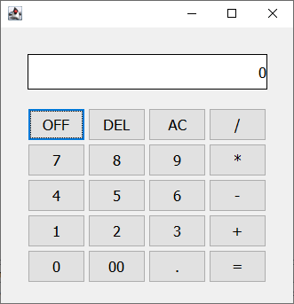

# Calculadora

Esta es una calculadora simple, con suma, resta, multiplicación, división, y manejo de decimales.

La calculadora descrita utiliza polimorfismo, para hacer flexible operaciones como agregar un número, operaciones, limpiar pantalla, etc., sin agregar más condicionales, se puede ver la mejora respecto a los commits anteriores.

En la siguiente imagen se pueden ver los diferentes elementos que se muestran en la interfaz gráfica.

